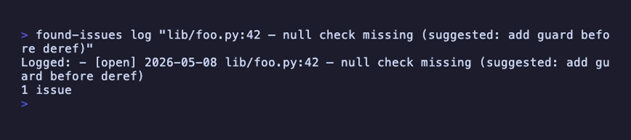
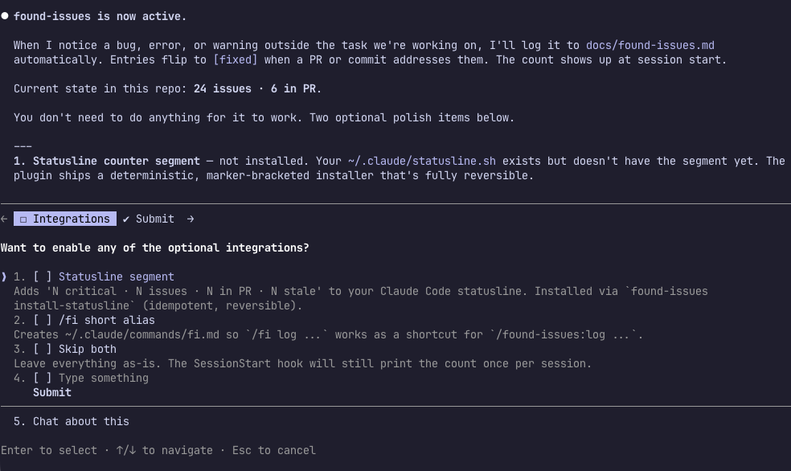
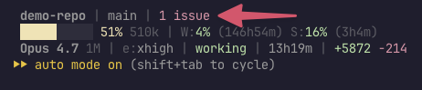

# found-issues

> Your AI agent has a blind spot. This fixes it.

[](https://github.com/AltDoug/found-issues/actions/workflows/test.yml)
[](LICENSE)
[](https://docs.claude.com/en/docs/claude-code/plugins)



When Claude notices a bug, error, or warning while working on something
else, it usually shrugs and moves on — *"pre-existing, not our code,
let's continue."* found-issues makes it stop, log the observation, and
surface it later. Automatically. Across sessions. **Without the user
lifting a finger.**

## Installation

Run these in Claude Code, in order:

```
/plugin marketplace add AltDoug/claude-plugins
/plugin install found-issues
```

Then **start a new Claude Code session** so the plugin loads (existing
sessions only pick it up after a fresh start; `/reload-plugins` works
in the *current* session if you'd rather not restart).

In the new session, run:

```
/found-issues:setup
```

This walks you through orientation in ~30 seconds and offers optional
polish (statusline integration, shorter `/fi` alias, per-repo git
pre-commit hook). Setup is **optional** — the plugin is fully active
without it — but running it once gets the polish wired up and removes
the guesswork. You can always re-run it later.



The plugin handles automatically:

- Auto-loading the agent rules into context every session
- Registering all 7 lifecycle hooks
- Adding the `found-issues` CLI to your PATH
- Working in any repo (auto-detects mode: local / git / github-direct / github-pr)

### Uninstalling

> **Order matters.** Run our cleanup *before* the platform uninstall, or
> plugin-private state will be orphaned in `~/.claude/`.

```
/found-issues:uninstall                            # 1. plugin's own cleanup
/plugin uninstall found-issues                     # 2. platform uninstall
/plugin marketplace remove altdoug-plugins         # 3. (only if you also want to remove the marketplace)
```

Why the order: `/plugin uninstall` (Claude Code's built-in command) only
removes the plugin code itself — it does **not** invoke our `uninstall` skill.
If you run it first, the statusline segment, onboarding marker, mode cache,
and `/fi` alias all stay behind in `~/.claude/`. They're invisible until you
reinstall later, at which point they cause confusing state mismatches (silent
broken statusline counter, orphaned alias, etc.).

`/found-issues:uninstall` runs `found-issues uninstall` which removes only
files our installer ever touched (manifest-tracked, conservative). Per-repo
`docs/found-issues.md` files are intentionally preserved — they're your
project data.

## What it does

The agent maintains a `docs/found-issues.md` file in each repo:

```
- [open] 2026-05-08 lib/foo.py:42 — null check missing (suggested: add guard)
- [open] [!] 2026-05-08 src/auth.ts:88 — leaks token in error (suggested: redact)
- [open] 2026-05-08 src/queue.py:12 — race on flush (PR: org/repo#42)
- [fixed] 2026-05-06 src/auth.ts:88 — race on session refresh (PR: org/repo#41) (fixed: 2026-05-08)
```

The closure loop runs **on its own**:

| When | What happens |
|---|---|
| Claude notices an out-of-scope issue | Logs it via `/found-issues:log` per the auto-loaded [rules](skills/rules/SKILL.md) |
| Claude opens a PR addressing an entry | Hook surfaces matching entries, prompts `/found-issues:annotate-pr <N>` |
| Claude commits a fix directly to main | Hook prompts `/found-issues:annotate-commit` |
| PR merges or commit lands on main | Next `SessionStart` flips `[open]` → `[fixed]` automatically |
| Referenced file/line is deleted | Tombstone detection auto-closes the entry |
| Branch with un-promoted entries about to be deleted | `pre-branch-delete` hook blocks until `/found-issues:promote` runs |

You see a count at session start, and in your statusline if you have
one wired up:



The file stays accurate. `[fixed]` history accumulates as a record.
Nothing requires manual bookkeeping.

### Deferring recurring issues

Sometimes a logged issue is real but not addressable now (out-of-scope, blocked, low priority). The plugin treats `[deferred]` as a first-class lifecycle state: tracked in the file, suppressed from the statusline counter, and flagged when it recurs.

```bash
# Defer with optional reason
/found-issues:defer src/auth.py:88 --reason "tracked in JIRA-1234"

# Promote back to [open] when ready to address
/found-issues:promote-deferred src/auth.py:88
```

**Recurrence detection.** When you `log` an issue that matches an existing `[deferred]` entry's dedup key, the plugin appends today's date to a `(touched: ...)` annotation on the deferred entry — no new `[open]` entry is created. After 3 touches (cycle 1 default), it nudges:

```
Touched deferred entry (now 3x, threshold 3): src/auth.py:88
Consider: found-issues promote-deferred --match auth.py
```

**Critical entries auto-promote.** Entries logged with `--critical` (the `[!]` flag) flip back to `[open]` automatically on the Nth touch — no manual step.

**Loop prevention.** If you promote and re-defer the same entry, the threshold for the next nudge doubles (cycle 1: 3 touches → cycle 2: 6 → cycle 3: 12 → ...). The history is preserved as evidence, but the bar to bug you about it again rises geometrically. Configurable via `FOUND_ISSUES_DEFER_TOUCH_THRESHOLD` (base, default 3) and `FOUND_ISSUES_DEFER_ESCALATION_FACTOR` (factor, default 2).

## How to use it day-to-day

Once installed, the plugin runs on its own — Claude logs as it works,
the statusline shows the count, entries auto-flip on PR/commit. But
the value compounds when you treat the log as a queue:

**Ask Claude what's open.** The file is auto-loaded into context every
session, so plain-English queries work:

> *"What's open in found-issues?"*
> *"Show me the critical ones."*
> *"What's the oldest unfixed entry?"*

No special command needed — Claude already has `docs/found-issues.md`
in context.

**Have an agent triage the easy ones.** When the queue gets long:

> *"Read docs/found-issues.md, pick three entries you can fix in under
> 10 minutes, and do them. Open a PR for each."*

The auto-loaded rules teach Claude to annotate entries it fixes (via
`/found-issues:annotate-pr` and the post-pr-create hook). When the PRs
merge, the entries flip to `[fixed]` automatically.

**Use the count as soft pressure.** When the statusline reads
`3 critical · 12 other`, it's a constant reminder that there's known
work waiting. The critical flag (`[!]`) bubbles drop-everything items
to the top. (The residual bucket labels as "issue/issues" when it's the
only counter on display and "other" when alongside critical / in PR /
stale, so the segment counts always add up cleanly.)

## Why this exists

Most AI coding agents have a **proactive blindspot**: they notice
defects in code they're reading, judge those defects as out-of-scope,
and silently move on. Sometimes they say "I noticed X but it's
pre-existing, not our problem." Then the bug stays in the codebase
forever — invisible to the user who'd never have spotted it themselves.

found-issues changes the contract. The agent maintains a tiny markdown
file as it works. Issues never disappear into the void. Eventually they
either get fixed (and auto-closed) or stay visible until they do.

## How is this different from…?

| | found-issues | GitHub Issues / Linear / Jira | Backlog.md / claude-mem |
|---|---|---|---|
| Tracks | Defects the AI noticed but didn't fix | Anything (features, bugs, tasks) | Generic markdown tasks / session memory |
| Created by | The AI agent (proactively) | Humans | Either |
| Storage | Plain markdown in your repo | Cloud DB | Markdown |
| Closure | Auto via PR/commit/tombstone | Manual | Manual |
| AI verification of unannotated entries | Yes | No | No |

You can run all of these together — they don't overlap functionally.

## Slash commands

All namespaced under `/found-issues:` (Claude Code plugin convention):

| Command | Use |
|---|---|
| `/found-issues:log <path:line> — <symptom>` | Log a new entry (Claude does this proactively) |
| `/found-issues:sync` | Reconcile with PR/commit history + AI-verify unannotated entries |
| `/found-issues:annotate-pr <N>` | Link an entry to a PR (auto-prompted by hooks) |
| `/found-issues:annotate-commit [<sha>]` | Link an entry to a commit (defaults to HEAD) |
| `/found-issues:promote` | Carry branch-only entries into main before branch deletion |
| `/found-issues:status` | Print current counts |
| `/found-issues:archive` | Move old `[fixed]` entries to `docs/found-issues-archive.md` (count threshold 50 OR days threshold 30, whichever first) |
| `/found-issues:setup` | Optional first-run orientation |
| `/found-issues:doctor` | General health check — CLI, statusline, gh, mode, hook opt-outs, issues file |
| `/found-issues:uninstall` | Clean up plugin-private state before `/plugin uninstall` |

**Want shorter typing?** `/found-issues:setup` offers an optional `/fi`
shortcut — pick it during setup and `/fi log src/foo.py:42 — bug` works
as a shortcut for `/found-issues:log src/foo.py:42 — bug`. Installed via
the deterministic `found-issues install-fi-alias` CLI subcommand;
removable via `found-issues uninstall-fi-alias`.

## Format

```
- [STATUS] [!] YYYY-MM-DD path:line — symptom (suggested: fix) (PR: org/repo#N) (fixed: YYYY-MM-DD)
```

- **Statuses**: `open` / `deferred` / `fixed`
- **`[!]`** optional critical flag (drop-everything priority)
- **` — `** is U+2014 em-dash with spaces, *not* a hyphen
- **Annotations** are optional but enable auto-flipping; `(PR: ...)` and
  `(commit: ...)` can coexist on one entry

Full grammar, regex patterns, and invalid examples: [`docs/format-spec.md`](docs/format-spec.md).

## Workflow modes

found-issues auto-detects which mode each repo is in:

| Mode | Detected when | Closure mechanism |
|---|---|---|
| `local` | No `.git/` directory | Manual + tombstone |
| `git` | Git repo, no GitHub remote | `(commit: <sha>)` + tombstone |
| `github-direct` | GitHub remote, no recent merged PRs | `(commit: <sha>)` + tombstone |
| `github-pr` | GitHub remote with recent merged PRs | `(PR: org/repo#N)` + commit + tombstone |

Mixed workflow (sometimes PR, sometimes direct push) is fully
supported — both annotation forms always work; mode just sets the
default.

Details + edge cases: [`docs/modes.md`](docs/modes.md).

## Platform support

Tested in CI on:

| OS | Shell | Status |
|---|---|---|
| Linux (Ubuntu) | bash | ✅ Supported |
| macOS | bash | ✅ Supported |
| Windows | Git Bash | ✅ Supported |

**Windows note**: the plugin's CLI and hooks are bash-based (`#!/usr/bin/env bash`), so they need a bash interpreter to run. On Windows, that's provided by [Git for Windows](https://gitforwindows.org/) (Git Bash) — a near-universal install for any Windows dev box. CI runs the full test suite on `windows-latest` under Git Bash and passes. WSL works too.

If you're on a Windows install without Git Bash or WSL, install Git for Windows first.

## Status & roadmap

**v1.0.6 — UX audit fixes** (P0 + 3 P1s from the 2026-05-10 end-to-end audit).

- 261 tests passing in CI on **Linux + macOS + Windows** (Git Bash)
- 7 hooks + 9 slash commands + a CLI binary, all wired through the
  Claude Code plugin spec
- Auto-detected modes; no per-repo configuration
- Optional per-repo git pre-commit hook for format validation outside
  Claude Code

Roadmap things being considered (not committed):

- Universal layer that works with Codex / Cursor / Aider
- AI-assisted dedup for semantic-similar entries
- Configurable stale threshold per repo
- Web dashboard / browser extension for non-terminal users

Open an issue if you have a use case for any of these.

## Docs

- [`docs/architecture.md`](docs/architecture.md) — how the pieces fit together
- [`docs/format-spec.md`](docs/format-spec.md) — canonical entry format
- [`docs/modes.md`](docs/modes.md) — workflow modes and detection
- [`docs/faq.md`](docs/faq.md) — common questions
- [`AGENTS.md`](AGENTS.md) — instructions for AI agents installing this
- [`CONTRIBUTING.md`](CONTRIBUTING.md) — how to propose changes
- [`CHANGELOG.md`](CHANGELOG.md) — version history

## Contributing

Issues and PRs welcome. See [CONTRIBUTING.md](CONTRIBUTING.md) for the
process. Quick PRs (typo fixes, small bugs) ship faster than big
proposals — for those, please open an issue first to discuss the design.

## License

MIT — see [LICENSE](LICENSE).

## Author

[AltDoug](https://github.com/AltDoug)
